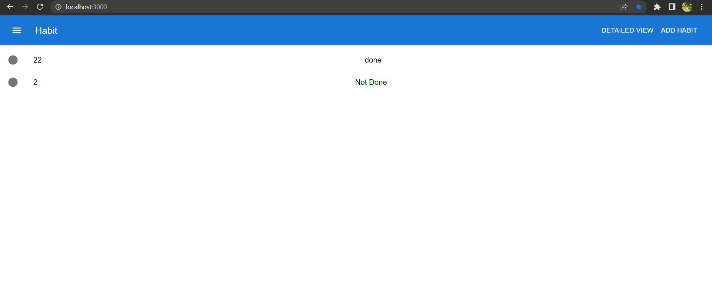
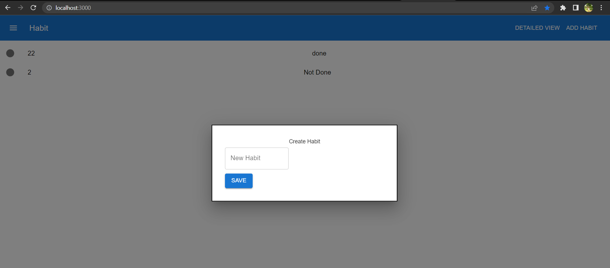
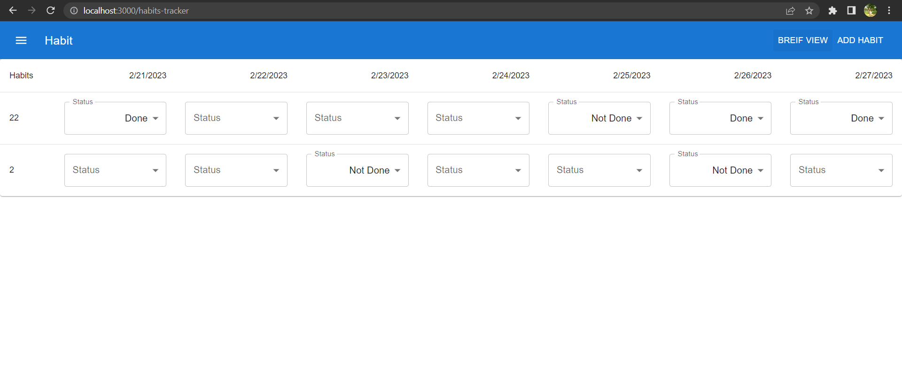

# Habit Tracker

This project is hoisted [here](https://placement-cell-one.vercel.app)

## How to setup locally

In the project directory, you can run:

### `npm install`

### `npm start`

Runs the app in the development mode.\
Open [http://localhost:3000](http://localhost:3000) to view it in your browser.

User can create the habits and track them on weekly basis

also user can add the habits by clicking on `Add Habit` button in the navbar

To set the status of habits user can click on `DETAILED VIEW` button in the navbar

